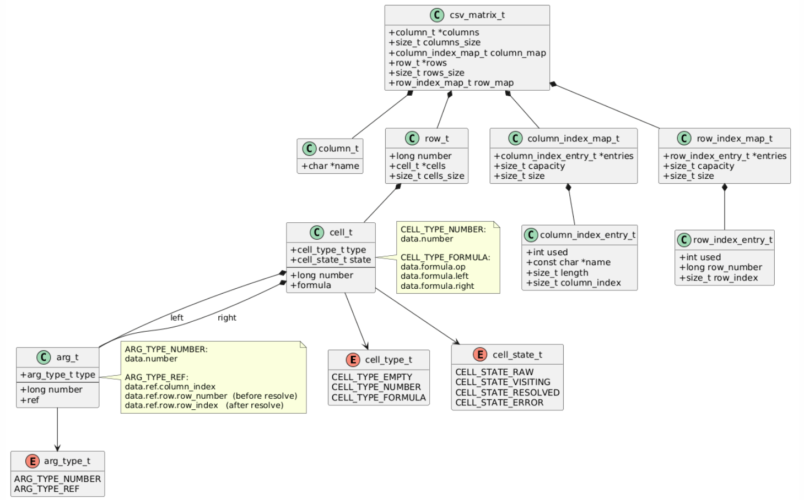
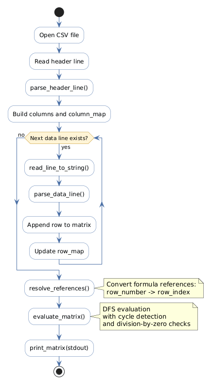

# CSV Reader

Программа читает CSV-таблицу с числами и формулами, вычисляет значения формул и печатает итоговую таблицу в CSV-виде в консоль.

## Сборка

```bash
make
```

Исполняемый файл будет создан по пути:

```text
build/csv_parser
```

## Запуск

```bash
./build/csv_parser path/to/file.csv
```

Результат работы печатается в `stdout`.

## Фичи проекта

- чтение CSV-файла с произвольным количеством строк и столбцов
- поддержка целых чисел и формул вида `=ARG1 OP ARG2`
- поддержка ссылок на ячейки в формате `ColumnNameRowNumber`
- вычисление длинных цепочек зависимостей между ячейками
- обнаружение циклических зависимостей
- обнаружение деления на ноль
- проверка некорректных ссылок и ошибок формата CSV
- вывод итоговой вычисленной таблицы обратно в CSV-виде в консоль

## Используемые алгоритмы и идеи

- собственный `string_t` для удобного динамического чтения строк CSV
- эвристическая оценка стартовой емкости буфера на основе размера файла, чтобы уменьшить количество `realloc`
- `DFS` для вычисления формул и обхода графа зависимостей между ячейками
- две hash table:
  - `column_map` для быстрого поиска `column name -> column_index`
  - `row_map` для быстрого поиска `row_number -> row_index`
- двухэтапная обработка ссылок:
  - во время парсинга сохраняется `row_number`
  - после чтения всего файла выполняется `resolve_references()`, и ссылка переводится в `row_index`

## Структура проекта

- `main.c` — точка входа: чтение файла, запуск парсинга, resolve ссылок, вычисление формул и вывод результата
- `src/parser.c` — разбор header, строк таблицы и формул
- `src/matrix.c` — хранение матрицы, maps для строк и столбцов, resolve ссылок, вывод таблицы
- `src/eval.c` — DFS-вычисление формул и обработка зависимостей
- `src/file_utils.c` — чтение строк из файла и вспомогательные функции для работы с файлом
- `src/custom_string.c` — динамический буфер строки для чтения CSV
- `inc/*.h` — публичные объявления, структуры и интерфейсы модулей

## Основные типы

Файл `inc/csv_types.h` содержит основную модель данных программы:

- `csv_matrix_t` — вся таблица целиком: столбцы, строки, `column_map` и `row_map`
- `column_t` — один столбец таблицы, хранит его имя
- `row_t` — одна строка таблицы: номер строки из CSV и массив ячеек
- `cell_t` — одна ячейка: число, пустое значение или формула
- `arg_t` — один аргумент формулы: либо число, либо ссылка на другую ячейку
- `cell_type_t` — тип содержимого ячейки (`EMPTY`, `NUMBER`, `FORMULA`), используем в связке с union
- `cell_state_t` — состояние ячейки при DFS-вычислении (`RAW`, `VISITING`, `RESOLVED`, `ERROR`) 

Для наглядности структура типов также показана на диаграмме:



## Пайплайн программы

1. Программа читает header и создает список столбцов.
2. Затем построчно читает данные и строит внутреннюю матрицу ячеек.
3. После полного чтения файла ссылки в формулах переводятся из `row_number` в `row_index`.
4. Затем формулы вычисляются через DFS с учетом зависимостей между ячейками.
5. Итоговая таблица печатается в CSV-виде в консоль.

Для наглядности пайплайн также можно посмотреть на диаграмме:



## Примеры CSV

В каталоге `csv/` лежат примеры входных файлов:

- `example_valid.csv` — корректный пример из задания
- `error_division_by_zero.csv` — деление на ноль
- `error_invalid_reference.csv` — ссылка на несуществующий столбец
- `error_duplicate_row.csv` — повторяющийся номер строки
- `error_cycle.csv` — циклическая зависимость

## Unit tests

В каталоге `tests/` лежат небольшие unit-тесты для основных модулей:

- `test_file_utils.c` — чтение строк и контроль длины строки
- `test_pipeline.c` — интеграционный сценарий для `parser`, `matrix`, `eval` и вывода

Запуск всех тестов:

```bash
make test
```

## Очистка артефактов сборки

```bash
make clean
```
